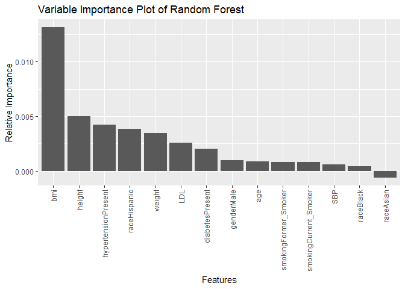
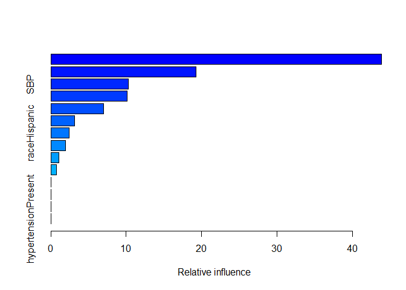

Predicting Severe Flu from Clinical and Demographic Covariates
================
Wayne Monical
2025-05-05

# Introduction

The goal of this report is to evaluate the relationship between
attributes and the risk of severe flu in the six-month period following
vaccinations. This report uses a data set containing one-thousand
observations, each from a unique individual. The variable of interest in
the data set is the presence of a case of severe flu in the six-month
period following vaccination. Of the one-thousand patients, two-hundred
and fifty-three of the patients experienced severe flu. The data set
contains eleven demographic, clinical, and lifestyle covariates
associated with each patient, namely age, gender, race, smoking status,
height, weight, BMI, the presence of diabetes and hypertension, systolic
blood pressure (SBP), and a measure of low-density lipoprotein (LDL). In
order to explore the relationship between demographic and clinical
factors, several machine learning models were trained. The logistic
regression model with elastic net penalty was selected as the final
model. It is a highly interpretable model, and it may be used to infer
the relationship between the demographic factors and the risk of
developing severe flu. This project was originally created as part of
Professor Yifei Sun’s Data Science for Machine learning class at the
University of Columbia’s Mailman School of Public Health.

# Exploratory Analysis

There are no missing values in the data set. The summary statistics and
relationship plots for the discrete and continuous variables are given
in the tables below. The strongest associations are between BMI, height,
and weight. This follows from our previous understanding that BMI is
calculated based on height and weight. The three-way association between
age, SBP, and LDL aligns with the understanding that older patients are
more at risk of cardiac health problems. We observe differences in the
incidence of severe flu in diabetes, hypertension, BMI, and weight, and
a smaller difference in LDL.

``` r
sumtable(flu, out = 'kable')
```

<table>

<caption>

Summary Statistics
</caption>

<thead>

<tr>

<th style="text-align:left;">

Variable
</th>

<th style="text-align:left;">

N
</th>

<th style="text-align:left;">

Mean
</th>

<th style="text-align:left;">

Std. Dev.
</th>

<th style="text-align:left;">

Min
</th>

<th style="text-align:left;">

Pctl. 25
</th>

<th style="text-align:left;">

Pctl. 75
</th>

<th style="text-align:left;">

Max
</th>

</tr>

</thead>

<tbody>

<tr>

<td style="text-align:left;">

age
</td>

<td style="text-align:left;">

1000
</td>

<td style="text-align:left;">

60
</td>

<td style="text-align:left;">

4.3
</td>

<td style="text-align:left;">

46
</td>

<td style="text-align:left;">

57
</td>

<td style="text-align:left;">

63
</td>

<td style="text-align:left;">

72
</td>

</tr>

<tr>

<td style="text-align:left;">

gender
</td>

<td style="text-align:left;">

1000
</td>

<td style="text-align:left;">

</td>

<td style="text-align:left;">

</td>

<td style="text-align:left;">

</td>

<td style="text-align:left;">

</td>

<td style="text-align:left;">

</td>

<td style="text-align:left;">

</td>

</tr>

<tr>

<td style="text-align:left;">

… Female
</td>

<td style="text-align:left;">

522
</td>

<td style="text-align:left;">

52%
</td>

<td style="text-align:left;">

</td>

<td style="text-align:left;">

</td>

<td style="text-align:left;">

</td>

<td style="text-align:left;">

</td>

<td style="text-align:left;">

</td>

</tr>

<tr>

<td style="text-align:left;">

… Male
</td>

<td style="text-align:left;">

478
</td>

<td style="text-align:left;">

48%
</td>

<td style="text-align:left;">

</td>

<td style="text-align:left;">

</td>

<td style="text-align:left;">

</td>

<td style="text-align:left;">

</td>

<td style="text-align:left;">

</td>

</tr>

<tr>

<td style="text-align:left;">

race
</td>

<td style="text-align:left;">

1000
</td>

<td style="text-align:left;">

</td>

<td style="text-align:left;">

</td>

<td style="text-align:left;">

</td>

<td style="text-align:left;">

</td>

<td style="text-align:left;">

</td>

<td style="text-align:left;">

</td>

</tr>

<tr>

<td style="text-align:left;">

… White
</td>

<td style="text-align:left;">

656
</td>

<td style="text-align:left;">

66%
</td>

<td style="text-align:left;">

</td>

<td style="text-align:left;">

</td>

<td style="text-align:left;">

</td>

<td style="text-align:left;">

</td>

<td style="text-align:left;">

</td>

</tr>

<tr>

<td style="text-align:left;">

… Asian
</td>

<td style="text-align:left;">

64
</td>

<td style="text-align:left;">

6%
</td>

<td style="text-align:left;">

</td>

<td style="text-align:left;">

</td>

<td style="text-align:left;">

</td>

<td style="text-align:left;">

</td>

<td style="text-align:left;">

</td>

</tr>

<tr>

<td style="text-align:left;">

… Black
</td>

<td style="text-align:left;">

184
</td>

<td style="text-align:left;">

18%
</td>

<td style="text-align:left;">

</td>

<td style="text-align:left;">

</td>

<td style="text-align:left;">

</td>

<td style="text-align:left;">

</td>

<td style="text-align:left;">

</td>

</tr>

<tr>

<td style="text-align:left;">

… Hispanic
</td>

<td style="text-align:left;">

96
</td>

<td style="text-align:left;">

10%
</td>

<td style="text-align:left;">

</td>

<td style="text-align:left;">

</td>

<td style="text-align:left;">

</td>

<td style="text-align:left;">

</td>

<td style="text-align:left;">

</td>

</tr>

<tr>

<td style="text-align:left;">

smoking
</td>

<td style="text-align:left;">

1000
</td>

<td style="text-align:left;">

</td>

<td style="text-align:left;">

</td>

<td style="text-align:left;">

</td>

<td style="text-align:left;">

</td>

<td style="text-align:left;">

</td>

<td style="text-align:left;">

</td>

</tr>

<tr>

<td style="text-align:left;">

… Never_Smoked
</td>

<td style="text-align:left;">

584
</td>

<td style="text-align:left;">

58%
</td>

<td style="text-align:left;">

</td>

<td style="text-align:left;">

</td>

<td style="text-align:left;">

</td>

<td style="text-align:left;">

</td>

<td style="text-align:left;">

</td>

</tr>

<tr>

<td style="text-align:left;">

… Former_Smoker
</td>

<td style="text-align:left;">

313
</td>

<td style="text-align:left;">

31%
</td>

<td style="text-align:left;">

</td>

<td style="text-align:left;">

</td>

<td style="text-align:left;">

</td>

<td style="text-align:left;">

</td>

<td style="text-align:left;">

</td>

</tr>

<tr>

<td style="text-align:left;">

… Current_Smoker
</td>

<td style="text-align:left;">

103
</td>

<td style="text-align:left;">

10%
</td>

<td style="text-align:left;">

</td>

<td style="text-align:left;">

</td>

<td style="text-align:left;">

</td>

<td style="text-align:left;">

</td>

<td style="text-align:left;">

</td>

</tr>

<tr>

<td style="text-align:left;">

height
</td>

<td style="text-align:left;">

1000
</td>

<td style="text-align:left;">

170
</td>

<td style="text-align:left;">

6.1
</td>

<td style="text-align:left;">

152
</td>

<td style="text-align:left;">

165
</td>

<td style="text-align:left;">

174
</td>

<td style="text-align:left;">

192
</td>

</tr>

<tr>

<td style="text-align:left;">

weight
</td>

<td style="text-align:left;">

1000
</td>

<td style="text-align:left;">

80
</td>

<td style="text-align:left;">

7.1
</td>

<td style="text-align:left;">

59
</td>

<td style="text-align:left;">

75
</td>

<td style="text-align:left;">

85
</td>

<td style="text-align:left;">

104
</td>

</tr>

<tr>

<td style="text-align:left;">

bmi
</td>

<td style="text-align:left;">

1000
</td>

<td style="text-align:left;">

28
</td>

<td style="text-align:left;">

2.8
</td>

<td style="text-align:left;">

20
</td>

<td style="text-align:left;">

26
</td>

<td style="text-align:left;">

30
</td>

<td style="text-align:left;">

37
</td>

</tr>

<tr>

<td style="text-align:left;">

diabetes
</td>

<td style="text-align:left;">

1000
</td>

<td style="text-align:left;">

</td>

<td style="text-align:left;">

</td>

<td style="text-align:left;">

</td>

<td style="text-align:left;">

</td>

<td style="text-align:left;">

</td>

<td style="text-align:left;">

</td>

</tr>

<tr>

<td style="text-align:left;">

… Not_Present
</td>

<td style="text-align:left;">

855
</td>

<td style="text-align:left;">

86%
</td>

<td style="text-align:left;">

</td>

<td style="text-align:left;">

</td>

<td style="text-align:left;">

</td>

<td style="text-align:left;">

</td>

<td style="text-align:left;">

</td>

</tr>

<tr>

<td style="text-align:left;">

… Present
</td>

<td style="text-align:left;">

145
</td>

<td style="text-align:left;">

14%
</td>

<td style="text-align:left;">

</td>

<td style="text-align:left;">

</td>

<td style="text-align:left;">

</td>

<td style="text-align:left;">

</td>

<td style="text-align:left;">

</td>

</tr>

<tr>

<td style="text-align:left;">

hypertension
</td>

<td style="text-align:left;">

1000
</td>

<td style="text-align:left;">

</td>

<td style="text-align:left;">

</td>

<td style="text-align:left;">

</td>

<td style="text-align:left;">

</td>

<td style="text-align:left;">

</td>

<td style="text-align:left;">

</td>

</tr>

<tr>

<td style="text-align:left;">

… Not_Present
</td>

<td style="text-align:left;">

536
</td>

<td style="text-align:left;">

54%
</td>

<td style="text-align:left;">

</td>

<td style="text-align:left;">

</td>

<td style="text-align:left;">

</td>

<td style="text-align:left;">

</td>

<td style="text-align:left;">

</td>

</tr>

<tr>

<td style="text-align:left;">

… Present
</td>

<td style="text-align:left;">

464
</td>

<td style="text-align:left;">

46%
</td>

<td style="text-align:left;">

</td>

<td style="text-align:left;">

</td>

<td style="text-align:left;">

</td>

<td style="text-align:left;">

</td>

<td style="text-align:left;">

</td>

</tr>

<tr>

<td style="text-align:left;">

SBP
</td>

<td style="text-align:left;">

1000
</td>

<td style="text-align:left;">

130
</td>

<td style="text-align:left;">

7.9
</td>

<td style="text-align:left;">

108
</td>

<td style="text-align:left;">

124
</td>

<td style="text-align:left;">

135
</td>

<td style="text-align:left;">

154
</td>

</tr>

<tr>

<td style="text-align:left;">

LDL
</td>

<td style="text-align:left;">

1000
</td>

<td style="text-align:left;">

110
</td>

<td style="text-align:left;">

20
</td>

<td style="text-align:left;">

41
</td>

<td style="text-align:left;">

98
</td>

<td style="text-align:left;">

123
</td>

<td style="text-align:left;">

174
</td>

</tr>

<tr>

<td style="text-align:left;">

severe_flu
</td>

<td style="text-align:left;">

1000
</td>

<td style="text-align:left;">

</td>

<td style="text-align:left;">

</td>

<td style="text-align:left;">

</td>

<td style="text-align:left;">

</td>

<td style="text-align:left;">

</td>

<td style="text-align:left;">

</td>

</tr>

<tr>

<td style="text-align:left;">

… Not_Present
</td>

<td style="text-align:left;">

747
</td>

<td style="text-align:left;">

75%
</td>

<td style="text-align:left;">

</td>

<td style="text-align:left;">

</td>

<td style="text-align:left;">

</td>

<td style="text-align:left;">

</td>

<td style="text-align:left;">

</td>

</tr>

<tr>

<td style="text-align:left;">

… Present
</td>

<td style="text-align:left;">

253
</td>

<td style="text-align:left;">

25%
</td>

<td style="text-align:left;">

</td>

<td style="text-align:left;">

</td>

<td style="text-align:left;">

</td>

<td style="text-align:left;">

</td>

<td style="text-align:left;">

</td>

</tr>

</tbody>

</table>

### Plotting Discrete Variables

``` r
discrete_cols = c('gender', 'race', 'smoking', 'diabetes', 'hypertension')
numeric_cols = c('age', 'height', 'weight', 'bmi', 'SBP', 'LDL')

flu |> 
  select(-numeric_cols) |> 
  pivot_longer(cols = discrete_cols, names_to = "Variable", values_to = "Value") |> 
  group_by(severe_flu, Variable, Value) |> 
  summarise(n = n(), .groups = "drop_last") |>
  mutate(Proportion = n / sum(n)) |>
  ggplot(aes(x = severe_flu, y = Proportion, fill = Value))+
  geom_bar(stat = 'identity', position = "dodge" )+
  facet_wrap(~ Variable, scales = "free_y") +
  labs(title = 'Severe Flu versus Continuous Variables') +
  xlab('Presence of Severe Flu') + 
  ylab('')+
  theme(legend.position = "none")
```

<!-- -->

### Plotting Continuous Variables

``` r
flu |> 
  pivot_longer(cols = numeric_cols, names_to = "Variable", values_to = "Value") |> 
  ggplot(aes(x = severe_flu, y = Value)) +
  geom_boxplot() +
  facet_wrap(~ Variable, scales = "free_y") +
  labs(title = 'Severe Flu versus Continuous Variables') +
  xlab('Presence of Severe Flu') + 
  ylab('')
```

<!-- -->

### Plotting Correlation

``` r
continuous = flu[,names(flu)[sapply(flu, is.numeric)]]
correlations = cor(continuous)
corrplot(correlations)
```

<!-- -->

# Methods

The data was randomly split into training and testing sets for model
building. A cross-validated resampling approach was used to tune the
hyper-parameters and test the model on unseen data. The hyper-parameters
were chosen to maximize the models’ accuracy. While this measure may
bias training towards the majority class (no severe flu) over other
considered metrics such as AUC ROC, the measure of accuracy is highly
interpretable, and therefore applicable to this study.

``` r
# sample for test/train split
set.seed(1)
test_set_index = sample(1:nrow(flu), size = round(0.7 * nrow(flu)), replace = FALSE)

x_train = x[test_set_index,]
y_train = flu$severe_flu[test_set_index]

x_test = x[-test_set_index,]
y_test = flu$severe_flu[-test_set_index]

# split data set with interactions
x_train_interaction = x_int[test_set_index,]
x_test_interaction =  x_int[-test_set_index,]
```

``` r
ctrl = 
  trainControl(
    method = "repeatedcv", 
    repeats = 5,
    number = 5,
    summaryFunction = defaultSummary,
    classProbs = TRUE)
```

Logistic regression, penalized logistic regression, support vector
machines, and tree-based models were trained on the data. The models
were evaluated by their average accuracy of the cross-validated
resamplings. The selected model was then evaluated on the test set to
get an unbiased evaluation of its performance. Logistic Regression

An unpenalized logistic regression model was trained on the data in
order to establish an initial estimate of linear effects. The reference
categories are white for race, female for gender, never smoked for
smoking status, and the absence of diabetes or hypertension. In order to
improve the model on unseen data, an elastic penalty was applied. The
continuous data (age, height, weight, BMI, SBP, and LDL), was scaled so
that the same penalty applied to each variable. The discrete variables
were not scaled in order to preserve their interpretability. In order to
test the interaction effects of the variables, another logistic
regression with an elastic penalty on all second order interaction
effects was also tested.

Advanced Models Support vector machine models were trained with one
linear and one radial kernel. The linear SVM was tested for performance
on costs 0.01, 0.1, 1, 5, 10, and 15. The radial kernel SVM was tested
for performance on sigma values 0.01, 0.05, and 0.1 and costs of 0.1, 1,
and 10. The random forest model was tested with tree depths ranging from
2 to 7 and minimum node sizes ranging from 2 to 6. The boosted random
forest model was trained with possible tree values of 25, 50, 75, 100,
and 150, interaction depth of 1, 2, and 3, a shrinkage value of 0.01,
0.03, or 0.06, and a minimum node size of 5 or 10.

# Logistic Regression

The coefficients for the three logistic regression models (unpenalized,
elastic net penalty, and elastic net penalty with interaction) are given
below. The penalized logistic regression model, the optimal
hyperparameters for alpha and lambda were found to be 1.0 and 0.00241,
respectively. Many variables, such as former smoker and weight, are
dropped from the penalized model. Height, originally associated with an
increase in the risk of severe flu, is associated with a decrease in the
risk of severe flu after the penalty is applied. BMI plays a significant
role in all three models. It is the single largest variable coefficient
in the first two models, and it is present in four of the interaction
terms in the interactions model.

``` r
flu.logistic_regression =
  train(x = x_train,
        y = y_train,
        method = "glm", 
        metric = 'Accuracy',
        trControl = ctrl)

summary(flu.logistic_regression$finalModel)
```

    ## 
    ## Call:
    ## NULL
    ## 
    ## Coefficients:
    ##                       Estimate Std. Error z value Pr(>|z|)    
    ## (Intercept)           -1.79398    0.24850  -7.219 5.23e-13 ***
    ## age                   -0.06102    0.10797  -0.565  0.57198    
    ## genderMale             0.15530    0.19238   0.807  0.41952    
    ## raceAsian              0.27317    0.38378   0.712  0.47659    
    ## raceBlack             -0.19693    0.26382  -0.746  0.45539    
    ## raceHispanic           0.35905    0.29956   1.199  0.23069    
    ## smokingFormer_Smoker   0.04467    0.21719   0.206  0.83706    
    ## smokingCurrent_Smoker  0.71111    0.31364   2.267  0.02337 *  
    ## height                 2.24364    1.10948   2.022  0.04315 *  
    ## weight                -2.86809    1.35200  -2.121  0.03389 *  
    ## bmi                    3.84560    1.48905   2.583  0.00981 ** 
    ## diabetesPresent        0.52978    0.25812   2.052  0.04012 *  
    ## hypertensionPresent    0.43204    0.32872   1.314  0.18875    
    ## SBP                   -0.02860    0.16587  -0.172  0.86310    
    ## LDL                    0.29283    0.10166   2.881  0.00397 ** 
    ## ---
    ## Signif. codes:  0 '***' 0.001 '**' 0.01 '*' 0.05 '.' 0.1 ' ' 1
    ## 
    ## (Dispersion parameter for binomial family taken to be 1)
    ## 
    ##     Null deviance: 766.87  on 699  degrees of freedom
    ## Residual deviance: 676.53  on 685  degrees of freedom
    ## AIC: 706.53
    ## 
    ## Number of Fisher Scoring iterations: 4

### Coefficients

``` r
data.frame(
  name = names(flu.logistic_regression$finalModel$coefficients),
  value = round(flu.logistic_regression$finalModel$coefficients, 3)) |> 
  knitr::kable()
```

|                       | name                  |  value |
|:----------------------|:----------------------|-------:|
| (Intercept)           | (Intercept)           | -1.794 |
| age                   | age                   | -0.061 |
| genderMale            | genderMale            |  0.155 |
| raceAsian             | raceAsian             |  0.273 |
| raceBlack             | raceBlack             | -0.197 |
| raceHispanic          | raceHispanic          |  0.359 |
| smokingFormer_Smoker  | smokingFormer_Smoker  |  0.045 |
| smokingCurrent_Smoker | smokingCurrent_Smoker |  0.711 |
| height                | height                |  2.244 |
| weight                | weight                | -2.868 |
| bmi                   | bmi                   |  3.846 |
| diabetesPresent       | diabetesPresent       |  0.530 |
| hypertensionPresent   | hypertensionPresent   |  0.432 |
| SBP                   | SBP                   | -0.029 |
| LDL                   | LDL                   |  0.293 |

## Penalized Logistic Regression

``` r
# train elastic net model
set.seed(1)
flu.elastic_net =
  train(x = x_train,
        y = y_train,
        method = "glmnet", 
        metric = 'Accuracy',
        trControl = ctrl)

# print the coefficients of the best model
coef = coef(flu.elastic_net$finalModel,
     s = flu.elastic_net$bestTune$lambda) 

data.frame(
  name = row.names(coef),
  val = round(coef[,'s1'], 3)
) |> 
  knitr::kable()
```

|                       | name                  |    val |
|:----------------------|:----------------------|-------:|
| (Intercept)           | (Intercept)           | -1.703 |
| age                   | age                   | -0.051 |
| genderMale            | genderMale            |  0.113 |
| raceAsian             | raceAsian             |  0.184 |
| raceBlack             | raceBlack             | -0.157 |
| raceHispanic          | raceHispanic          |  0.344 |
| smokingFormer_Smoker  | smokingFormer_Smoker  |  0.000 |
| smokingCurrent_Smoker | smokingCurrent_Smoker |  0.607 |
| height                | height                | -0.097 |
| weight                | weight                |  0.000 |
| bmi                   | bmi                   |  0.692 |
| diabetesPresent       | diabetesPresent       |  0.512 |
| hypertensionPresent   | hypertensionPresent   |  0.328 |
| SBP                   | SBP                   |  0.000 |
| LDL                   | LDL                   |  0.287 |

### Training error

``` r
print(mean(flu.elastic_net$resample$Accuracy))
```

    ## [1] 0.7796894

### Best Parameters

``` r
flu.elastic_net$bestTune
```

    ##   alpha      lambda
    ## 8     1 0.002410841

### Cross Validation Plot

``` r
plot(flu.elastic_net)
```

<!-- -->

### Lambda Values Versus Coefficients

``` r
plot(flu.elastic_net$finalModel)
```

<!-- -->

## Elastic Net with Interaction

``` r
# train elastic net model
set.seed(2)
flu.elastic_net_interaction =
  train(x = x_train_interaction,
        y = y_train,
        method = "glmnet", 
        metric = 'Accuracy',
        trControl = ctrl)

# print the non-zero coefficients of the best model
coeffs = 
  coef(flu.elastic_net_interaction$finalModel,
     s = flu.elastic_net_interaction$bestTune$lambda)

coeff_names = row.names(coeffs)
coeff_vals = coeffs[,'s1']
names(coeff_vals) = coeff_names

# non zero coeffs 
coeffs_non_zero = coeff_names[coeff_vals > 0]
coeffs_non_zero = coeffs_non_zero[2:length(coeffs_non_zero)] # drop intercept

data.frame(
  name = coeffs_non_zero,
  value =  round(coeff_vals[coeffs_non_zero], 3)) |> 
  arrange(-value) |> 
  knitr::kable()
```

|  | name | value |
|:---|:---|---:|
| raceAsian:smokingCurrent_Smoker | raceAsian:smokingCurrent_Smoker | 1.928 |
| smokingCurrent_Smoker:diabetesPresent | smokingCurrent_Smoker:diabetesPresent | 0.585 |
| genderMale:raceHispanic | genderMale:raceHispanic | 0.234 |
| bmi:LDL | bmi:LDL | 0.226 |
| raceHispanic:smokingFormer_Smoker | raceHispanic:smokingFormer_Smoker | 0.224 |
| bmi:SBP | bmi:SBP | 0.131 |
| genderMale:diabetesPresent | genderMale:diabetesPresent | 0.078 |
| diabetesPresent:LDL | diabetesPresent:LDL | 0.050 |
| smokingCurrent_Smoker:LDL | smokingCurrent_Smoker:LDL | 0.026 |
| genderMale:smokingCurrent_Smoker | genderMale:smokingCurrent_Smoker | 0.011 |
| diabetesPresent:hypertensionPresent | diabetesPresent:hypertensionPresent | 0.008 |

### Training error

``` r
print(mean(flu.elastic_net_interaction$resample$Accuracy))
```

    ## [1] 0.7768605

### Cross Validation Plot

``` r
plot(flu.elastic_net_interaction)
```

<!-- -->

### Lambda Values Versus Coefficients

``` r
plot(flu.elastic_net_interaction$finalModel)
```

<!-- -->

### Best Parameters

``` r
flu.elastic_net_interaction$bestTune
```

    ##   alpha     lambda
    ## 9     1 0.02410841

# Support Vector Machines

The optimal cost for the linear support vector machine was found to be
equal to 0.01. The optimal cost for the radial support vector machine
was found to be equal to 0.1 with a sigma value of 0.01. Below is the
SVM decision boundary linear and radial kernel for a Hispanic man, a
current smoker, with diabetes and hypertension. The linear kernel has a
straight decision boundary, while the radial kernel may have a curved
decision boundary. The linear and radial SVMs achieved a training
accuracy of 0.766 and 0.765 respectively.

### Linear SVM

``` r
# train elastic net model with kernlab package
set.seed(3)
flu.linear_svm =
  train(x = x_train,
        y = y_train,
        method = "svmLinear",
        # tuneLength = seq(0.1, 5, len = 10),
        tuneGrid = expand.grid(C = c(0.01, 0.1, 1, 5, 10, 15)),
        preProc = c("center", "scale"),
        metric = 'Accuracy',
        trControl = ctrl,
        verbose = FALSE)
```

    ## maximum number of iterations reached 0.002864286 0.002800142maximum number of iterations reached 0.003110487 0.003077752maximum number of iterations reached 0.002994584 0.002921934maximum number of iterations reached 0.003897993 0.003805927maximum number of iterations reached 0.0001430931 0.0001425083maximum number of iterations reached 0.003129758 0.003047069maximum number of iterations reached 0.003622223 0.003526013maximum number of iterations reached 0.001695376 0.001674067maximum number of iterations reached 0.00181374 0.001783945maximum number of iterations reached 0.001167042 0.001152664maximum number of iterations reached 0.001605623 0.001581121maximum number of iterations reached 9.465958e-06 9.46189e-06maximum number of iterations reached 7.64191e-05 7.63276e-05maximum number of iterations reached 0.004358307 0.00425643maximum number of iterations reached 0.003979879 0.003865721maximum number of iterations reached 0.003651491 0.003554336maximum number of iterations reached 0.004316032 0.004217583maximum number of iterations reached 0.005327536 0.00520255maximum number of iterations reached 0.004109974 0.003998381maximum number of iterations reached 0.001200338 0.001186998maximum number of iterations reached 0.002571533 0.002528628maximum number of iterations reached 0.003344183 0.003249517maximum number of iterations reached 0.0001272949 0.0001269008maximum number of iterations reached 0.0003232832 0.0003221214maximum number of iterations reached 0.001933328 0.001904514maximum number of iterations reached 0.002228221 0.0021656maximum number of iterations reached 0.001319082 0.001294368maximum number of iterations reached 0.002552202 0.002496928maximum number of iterations reached 6.100129e-05 6.088662e-05maximum number of iterations reached 0.0009431871 0.0009327958maximum number of iterations reached 0.0044968 0.004367214maximum number of iterations reached 7.582959e-05 7.569539e-05maximum number of iterations reached 0.0002122359 0.0002114794maximum number of iterations reached 0.00018215 0.0001817785maximum number of iterations reached 4.115627e-05 4.108941e-05maximum number of iterations reached 0.001183055 0.001167852maximum number of iterations reached 0.0003772029 0.0003758528maximum number of iterations reached 0.001744493 0.001708348maximum number of iterations reached 0.003574656 0.003475412maximum number of iterations reached 0.00169629 0.001675751maximum number of iterations reached 2.443168e-05 2.441172e-05maximum number of iterations reached 0.001812821 0.001783812maximum number of iterations reached 0.0003735274 0.0003714165maximum number of iterations reached 0.001616509 0.001585318

### Best Parameters

``` r
flu.linear_svm$bestTune
```

    ##      C
    ## 1 0.01

### Training Error

``` r
print(mean(flu.linear_svm$resample$Accuracy))
```

    ## [1] 0.766285

### Cross Validation Plot

``` r
plot(flu.linear_svm)
```

<!-- -->

### Linear SVM Decision Boundary

``` r
args_list =
  x_train |> 
  colMeans() |> 
  as.list()

args_list$bmi = seq(min(x_train[,'bmi']), max(x_train[,'bmi']), length = 100)
args_list$LDL = seq(min(x_train[,'LDL']), max(x_train[,'LDL']), length = 100)
args_list$genderMale = 1
args_list$smokingCurrent_Smoker = 1
args_list$diabetesPresent = 1
args_list$hypertensionPresent = 1
args_list$raceHispanic = 1
args_list$SBP = 10
args_list$age = 3

  
grid = do.call(expand.grid, args_list)

# Predict on the grid
grid$Pred <- predict(flu.linear_svm, newdata = grid)

# Plot decision boundary
x_train |> 
  as.data.frame() |> 
  mutate(severe_flu = y_train) |> 
  ggplot(aes(x = bmi, y = LDL)) +
  geom_point(aes(color = severe_flu)) +
  geom_tile(data = grid, aes(x = bmi, y = LDL, fill= Pred), alpha = 0.2) +
  labs(title = "Linear SVM Decision Boundary") +
  theme_minimal()
```

<!-- -->

## SVM with Radial Kernel

``` r
# train elastic net model with kernlab package
set.seed(4)
flu.radial_svm =
  train(x = x_train,
        y = y_train,
        method = "svmRadial",
        tuneGrid = expand.grid(
          sigma = c(0.01, 0.05, 0.1),
          C = c(0.1, 1, 10)),
        preProc = c("center", "scale"),
        metric = 'Accuracy',
        trControl = ctrl)
```

### Best Parameters

``` r
flu.radial_svm$bestTune
```

    ##   sigma   C
    ## 1  0.01 0.1

### Training Accuracy

``` r
print(mean(flu.radial_svm$resample$Accuracy))
```

    ## [1] 0.765442

### Cross-Validation Plot

``` r
plot(flu.radial_svm)
```

<!-- -->

### Decision Boundary

``` r
args_list =
  x_train |> 
  colMeans() |> 
  as.list()

args_list$bmi = seq(min(x_train[,'bmi']), max(x_train[,'bmi']), length = 100)
args_list$LDL = seq(min(x_train[,'LDL']), max(x_train[,'LDL']), length = 100)
args_list$smokingCurrent_Smoker = 1
args_list$diabetesPresent = 1
args_list$hypertensionPresent = 1
args_list$raceHispanic = 1
args_list$genderMale = 1

grid = do.call(expand.grid, args_list)

# Predict on the grid
grid$Pred <- predict(flu.radial_svm, newdata = grid)

# Plot decision boundary
x_train |> 
  as.data.frame() |> 
  mutate(severe_flu = y_train) |> 
  ggplot(aes(x = bmi, y = LDL)) +
  geom_point(aes(color = severe_flu)) +
  geom_tile(data = grid, aes(x = bmi, y = LDL, fill= Pred), alpha = 0.2) +
  labs(title = "Radial SVM Decision Boundary") +
  theme_minimal()
```

<!-- -->

# Tree-Based Methods

The random forest model achieved a cross-validated accuracy of 0.773.
BMI, height, and hypertension were identified as the most relevant
factors in the model by the variable importance plot. However, when the
model was boosted, the clinical measures of LDL and SBP became
significantly more important. The boosted random forest model achieved a
cross-validated accuracy of 0.776, slightly improving the original
model.

## Random Forest

Below I train a random forest to predict out of state tuition. I plot
the importance of each variable in the data set and find that the
`Expend` variable, the instruction expenditure per student, is the most
important variable for predicting `Outstate`, the variable of interest.
I report that the test error for this model is equal to 1553.659, as
measured by RMSE.

``` r
rf.grid <- expand.grid(mtry = 1:7,
                       splitrule = 'extratrees',
                       min.node.size = 2:6)
set.seed(5)
flu.rf =
  train(
    x = x_train,
    y = y_train,
    method = "ranger",
    tuneGrid = rf.grid,
    metric = 'Accuracy',
    importance = 'permutation',
    trControl = ctrl)

ggplot(flu.rf, highlight = TRUE)+
  labs(title = "Random Forest Model Training")
```

<!-- -->

### Training Accuracy

``` r
print(mean(flu.rf$resample$Accuracy))
```

    ## [1] 0.7725729

### Best Parameterss

``` r
flu.rf$bestTune
```

    ##    mtry  splitrule min.node.size
    ## 15    3 extratrees             6

### Variable Importance

``` r
flu_feature_importance = ranger::importance(flu.rf$finalModel)

data.frame(
  feature = names(flu_feature_importance),
  importance = flu_feature_importance) |> 
  ggplot(aes(x = reorder(feature, -importance), y = importance)) +
  geom_bar(stat = "identity")+ 
  theme(axis.text.x = element_text(angle = 90, vjust = 0.5, hjust=1))+
  labs(title = 'Variable Importance Plot of Random Forest')+
  xlab('Features')+
  ylab('Relative Importance')
```

<!-- -->

## Boosting the Random Forest

Below I apply the boosting algorithm to the random forest, using the
previous model as a starting point. Again, I plot the importance of each
variable, and find again that per student expendicture is the most
powerful predictor in the model, again followed by room and board cost.
I report the test error of this model to be 1497.826 as measured by
RMSE, a slight improvement over the previous model.

``` r
gbm.grid = 
  expand.grid(
    n.trees = c(25, 50, 75, 100, 150),
    interaction.depth = 1:3,
    shrinkage = c(0.01, 0.03, 0.06),
    n.minobsinnode = c(5, 10))

set.seed(6)
flu.gbm =
  train(
    x = x_train,
    y = y_train,
    method = "gbm",
    tuneGrid = gbm.grid,
    trControl = ctrl,
    metric = 'Accuracy',
    verbose = FALSE 
  )

ggplot(flu.gbm, highlight = TRUE)+
  labs(title = 'Boosted Random Forest Model Training')
```

<!-- -->

### Variable Importance

``` r
flu.gmb.summary = summary(flu.gbm)
```

<!-- -->

``` r
flu.gmb.summary |> 
  ggplot(aes(x = reorder(var, -rel.inf), y = rel.inf)) + 
  geom_bar(stat = "identity")+ 
  theme(axis.text.x = element_text(angle = 90, vjust = 0.5, hjust=1))+
  labs(title = 'Variable Importance Plot of Boosted Random Forest')+
  xlab('Features')+
  ylab('Relative Importance')
```

<!-- -->

# Model Comparison

The models performed similarly on the training set, each within the
range of less than two percent accuracy. The elastic net achieved the
highest average cross validated accuracy by one percentage point. Other
models, such as the elastic net with interaction and the linear SVM
offer a more consistent average, since they achieved a lower standard
deviation of accuracy scores during model training. Evaluating the
selected model, the elastic net, on the test set, it achieves an
accuracy of 0.733, which is lower than training.

``` r
# aggregating models
model.Accuracy= 
  rbind(
  data.frame(
    model = 'Elastic Net',
    Accuracy = flu.elastic_net$resample$Accuracy),
  data.frame(
    model = 'Elastic Net with Interaction',
    Accuracy = flu.elastic_net_interaction$resample$Accuracy),
  data.frame(
    model = 'Linear SVM',
    Accuracy = flu.linear_svm$resample$Accuracy
  ),
  data.frame(
    model = 'Radial SVM',
    Accuracy = flu.radial_svm$resample$Accuracy
  ),
  data.frame(
    model = 'Random Forest',
    Accuracy = flu.rf$resample$Accuracy
  ),
    data.frame(
    model = 'Boosted Random Forest',
    Accuracy = flu.gbm$resample$Accuracy
  )
)

# average Accuracy
model.Accuracy %>% 
  group_by(model) %>% 
  summarize(
    round(mean(Accuracy), 3),
    round(sd(Accuracy), 3)) %>% 
  knitr::kable(col.names = c('Model', 'Mean CV Accuracy', 'SD CV Accuracy'))
```

| Model                        | Mean CV Accuracy | SD CV Accuracy |
|:-----------------------------|-----------------:|---------------:|
| Boosted Random Forest        |            0.776 |          0.020 |
| Elastic Net                  |            0.780 |          0.017 |
| Elastic Net with Interaction |            0.777 |          0.012 |
| Linear SVM                   |            0.766 |          0.007 |
| Radial SVM                   |            0.765 |          0.011 |
| Random Forest                |            0.773 |          0.011 |

Plotting the models’ Accuracy scores.

``` r
model.Accuracy |>
  ggplot(aes(x = model, y = Accuracy)) +
  geom_violin()+
  stat_summary(
    fun = "mean",
               geom = "point",
               color = "red")+
  labs(title = "Model Accuracy Comparison", xlab = "Model")+ 
  theme(axis.text.x = element_text(angle = 35, vjust = 0.95, hjust=1))
```

<!-- -->

## Test Set Evaluation

``` r
preds = predict(flu.elastic_net, x_test_interaction)

confusionMatrix(preds, reference = y_test)
```

    ## Confusion Matrix and Statistics
    ## 
    ##              Reference
    ## Prediction    Not_Present Present
    ##   Not_Present         207      72
    ##   Present               6      15
    ##                                           
    ##                Accuracy : 0.74            
    ##                  95% CI : (0.6865, 0.7887)
    ##     No Information Rate : 0.71            
    ##     P-Value [Acc > NIR] : 0.1394          
    ##                                           
    ##                   Kappa : 0.186           
    ##                                           
    ##  Mcnemar's Test P-Value : 1.842e-13       
    ##                                           
    ##             Sensitivity : 0.9718          
    ##             Specificity : 0.1724          
    ##          Pos Pred Value : 0.7419          
    ##          Neg Pred Value : 0.7143          
    ##              Prevalence : 0.7100          
    ##          Detection Rate : 0.6900          
    ##    Detection Prevalence : 0.9300          
    ##       Balanced Accuracy : 0.5721          
    ##                                           
    ##        'Positive' Class : Not_Present     
    ## 

## ROC Curve

``` r
roc_obj <- roc(response = as.numeric(y_test), predictor = as.numeric(preds))
```

    ## Setting levels: control = 1, case = 2

    ## Setting direction: controls < cases

``` r
plot(roc_obj, col = "blue", print.auc = TRUE)
```

<!-- -->

# Conclusion

I recommend that any researchers interested in understanding the
relationship between severe flu and the covariates of interest use the
logistic regression model with elastic net penalty. The boosted random
forest and support vector machine models do not provide better
predictive power than the simpler, more interpretable elastic net, and
they perform worse during cross validation. In order to create a risk
score, the researchers may apply the logistic regression model to new
data to obtain the estimated probability of developing severe flu in the
six-month period after vaccination. This value will fall between zero
and one, with a low value corresponding to low risk for severe flu, and
a higher score corresponding to elevated risk. The key demographic and
clinical factors that predicted risk of severe flu were BMI, LDL, and
SBP, as identified by the variable importance plots of the random forest
models and the penalized logistic regression model.
